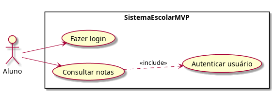

# Caso de Uso: Consultar Notas

## Objetivo
Permitir que o aluno consulte suas notas no sistema escolar.

## Escopo
MVP do Sistema Escolar.

## Atores
- Aluno

## Pré-condições
- O aluno deve estar cadastrado no sistema.
- O aluno deve estar autenticado.

## Pós-condições
- As notas do aluno são exibidas na tela.

## Diagrama de Caso de Uso

## Fluxo Principal
1. O aluno acessa o sistema escolar.
2. O sistema apresenta a tela de login.
3. O aluno informa login e senha.
4. O sistema valida as credenciais.
5. O aluno seleciona a opção **Consultar notas**.
6. O sistema recupera as notas do aluno.
7. O sistema exibe as notas por disciplina.

## Fluxo Alternativo
### A1. Consulta sem detalhamento
1. No passo 7, o sistema exibe apenas a nota final de cada disciplina.
2. O aluno encerra a consulta.

## Fluxo de Exceção
### E1. Credenciais inválidas
1. No passo 4, o sistema identifica que o login ou a senha estão incorretos.
2. O sistema exibe uma mensagem de erro.
3. O sistema retorna para a tela de login.
